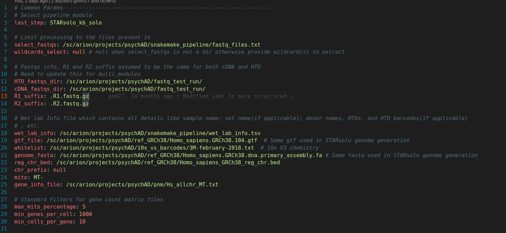

# Demultiplex pooled snRNA seq datasets

This setup shows one complex workflow that will be simplified and streamlined by this pipeline. 

To make it more interesting, this tutorial will annotate individual samples through genotype based demultiplexing (using cellSNP-vireoSNP workflow) as well as HTO based demultiplexing (using kite-hashsolo workflow).

## Pipeline overwiew

The pipeline can be visualized as:

```{mermaid}
   %%{ 
      init: {
         "theme":"neutral",
         "themeVariables": {
           "fontSize":20,
           "primaryColor":"#BB2528",
           "primaryTextColor":"#fff",
           "primaryBorderColor":"#7C0000",
           "lineColor":"#F8B229",
           "secondaryColor":"#006100",
           "tertiaryColor":"#fff"
         },
         "flowchart": { "wrap": true, "width": 300 }
      }
   }%%

   flowchart TB
      subgraph cDNA
         direction TB
         id1[/cDNA fastqs/]-->|align|id2(STARsolo)-->|"filter cells"|id3("cellSNP (cellsnp-lite)")
         id3-->id6{"all genotypes<br/>available?"}
         subgraph PICARD
            direction LR
            A(CollectGcBiasMetrics)
            B(CollectRnaSeqMetrics)
         end
      end
      subgraph genotype-based
         id6-->|yes|id8("vireoSNP<br/>without<br/>genotypes")-->|identify<br/>swaps|id9(QTLtools-mbv)
         id9-->|"rectify<br/>swaps"|id11(vireoSNP)
         subgraph SNPs
            direction LR
            id4[("External Genotypes <br/>(SNParray or WGS)")]
            id5[("1000 Genomes Project")]
            style id4 fill:#348ceb,stroke:#333,stroke-width:4px
            style id5 fill:#348ceb,stroke:#333,stroke-width:4px
         end
      end
      subgraph demultiplex
         direction TB
         id12(custom scripts)-->id13[/"final count<br/>matrix"/]
      end
      subgraph kite
         direction TB
         id14[/HTO fastqs/]-->id18("run kallisto")
         id16("create feature<br/>barcode file")-->|"create mismatch<br/>FASTA<br/> and t2g files"|id17("featuremap<br/>(pachter/kite lab)")
         id17-->|mismatch<br/>FASTA|id15("build kallisto index")
         id15-->id18
         id18-->|"run bustools"|id19("correct, sort<br/>and<br/>count")
         id19-->|"hashing<br/>count<br/>matrix"|id20(hashsolo)
      end
      id2-->|"collect read stats"|PICARD
      SNPs-->|"common SNPs"|id3
      id4-->id9
      id4-->|"correct<br/>donors"|id11
      id11-->id12
      id2-->|"filter cells"|id20
      id20-->id12
      id6-->|no|kite
```

## Preparing target files

Firstly, we need to create a list of file structure (derived from our fastq files), which will be used by the rule input_processing(add link here) to read in wildcards

### Fastq File Structure

asdasd

## Configuration File

To begin with, any utilisation of this pipeline starts with setting up the configuration file *new_config.yaml*

This yaml config file (new_config.yaml) has all relevant options for each rule present in this pipeline. Furthermore, this file has been sectioned, through comments, into separate sub-workflow modules in a way containing rule-specific options/parameters (ocurring in the order of their appearance in the sub-workflow scripts). Typically, there are certain parameters that need not be changed irrespective of the project the pipeline is being used for

### Common (project-specific) parameters

The following pictures showcase parameters that are only project-specific.

#### DAG control and project info params

:::{figure-md}


new_config.yaml (Part 1)
:::

#### Folder structures

:::{figure-md}


new_config.yaml (Part 2)
:::

#### Extra Info (can be removed soon!)

:::{figure-md}


new_config.yaml (Part 3)
:::

#### Module selector

**last_step**:
    This is the key which needs to be fed one of the {ref}`pre-selected modules <sub_workflows:Selectable Modules>`

## Project-specific changes to rules

## Changes to executor script

Finally we have to setup the 2 executor scripts:

..Snakefile:


